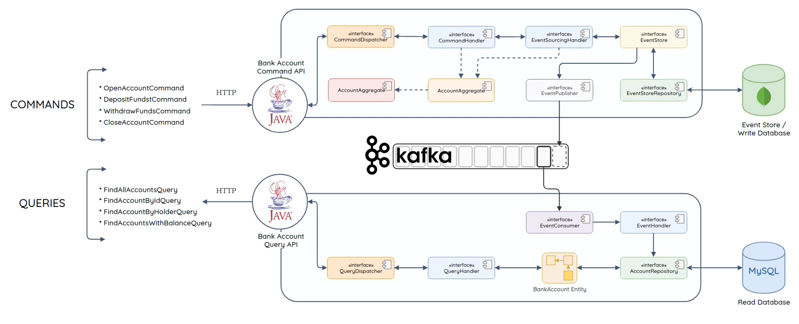

# Teck Bank

This is a service in a microservices architecture that manages **Tech Bank customer accounts**. One of the goals is to use Event Sourcing, the CQRS design in a Java environment.

## Goals:

1. Illustrate the CQS/CQRS usages in a simple and clear manner
2. Show how using kafka in event sourcing
3. Training in database use and reading and writing
4. Use different technologies
5. Having fun :) 

## Architecture

